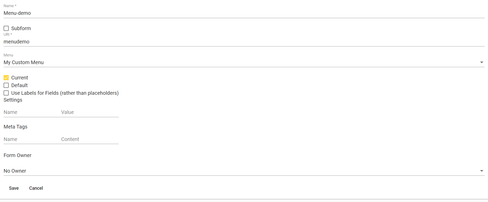
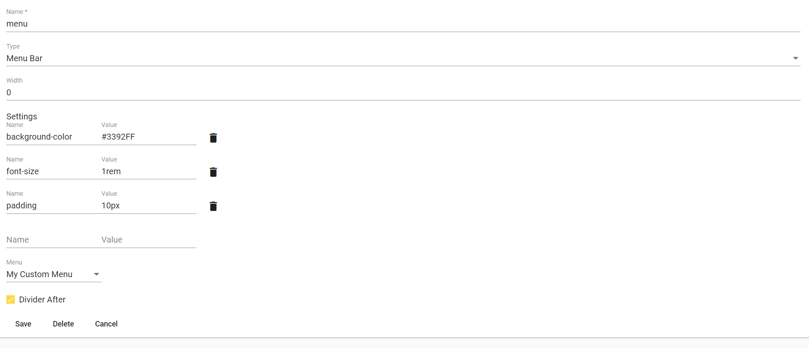

From the previous section we now have a menu setup. It's time to add it on our front end.

1. Go to the Admin Module
2. Select the Admin Module Menu
3. Select 'Page Management'
4. Select 'Setup Pages'
5. Click on 'Add' to create a new page

From here, we have two ways of adding a menu to the newly created page.

6. First one is pretty straightforward, we can simply select the menu that we created from the menu dropdown as shown.

Just by doing this, we will get the result as follows:

However, In order to style the menu we will need to follow the other way:

7. Create a page in a similar way as we did above but this time, don't add the menubut leave it to default (No-Menu)
8. Now, click on the form control icon next to the page
9. Click on 'Add' to add a new section to the page
10. Select the type as Menu bar, give a name to the section
11. At the bottom, select the menu that we created
12. In the settings input fields, we can add as many CSS properties as we want to as shown in the example

13. In this way, we can add CSS to style the menu and now the result is as follows:

All menus created using Project CX are completely responsive and works absolutely fine on small screen devices too

